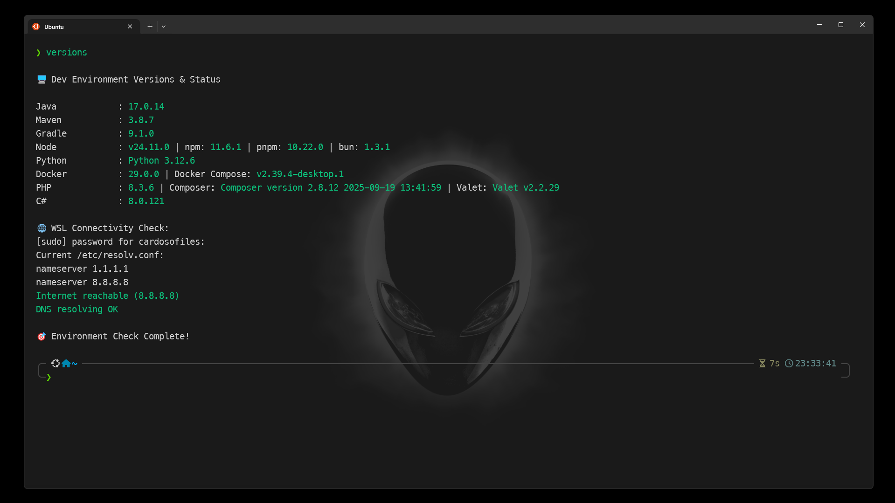

<div align="center" id="top">

<h1 align="center">🚀 Ambiente Dev no WSL (Ubuntu) – Guia Completo</h1>

[](#índice)
[](https://learn.microsoft.com/windows/wsl/)
[](https://ubuntu.com/wsl)
[](#7-nodejs-com-fnm-fast-node-manager)
[](#8-java-maven-e-gradle-com-sdkman)
[](#9-php)
[](#10-c-net---instalação-e-configuração)
[](#11-docker-nativo-no-wsl-alta-performance)
[](#configurar-git-global)
[](#13-github-cli-e-chave-ssh)

Este guia configura um terminal moderno, de altíssima performance e nível Sênior no Windows via WSL2 (Ubuntu). Inclui otimizações de sistema (Debloat), devolução de memória RAM dinâmica, Zsh + Oh My Zsh, tema Powerlevel10k, ferramentas de desenvolvimento em suas versões mais recentes (Node.js, Java, PHP, .NET) e **Docker Engine Nativo** integrado ao `systemd` (sem o peso do Docker Desktop).

[](https://skillicons.dev)

</div>

---

- Testado em: Windows 11 + WSL 2 (Ubuntu 24.04/22.04 LTS)
- Shell: `zsh`



## Índice

### 📚 Guia Principal

- [Introdução e Pré-requisitos](#pré-requisitos)
- [1. Instalação do WSL (Ubuntu)](#1-instale-e-configure-o-wsl-ubuntu)
  - [1.1 Otimização de Performance (.wslconfig)](#11-otimização-de-performance-wslconfig)
- [2. Atualização do sistema](#2-atualize-o-sistema)
  - [2.1 Limpeza e Debloat (Alta Performance)](#21-limpeza-e-debloat-alta-performance)
- [3. Zsh + Oh My Zsh](#3-configure-zsh--oh-my-zsh)
- [4. Tema Powerlevel10k](#4-tema-moderno-com-powerlevel10k)
  - [Alternativa: Starship (prompt)](#alternativa-starship-prompt)
- [5. Plugins do Zsh](#5-plugins-úteis-para-zsh)
- [6. FZF (busca interativa)](#6-fzf-busca-interativa)
- [7. Node.js (fnm) + pnpm](#7-nodejs-com-fnm-fast-node-manager)
- [8. Java/Maven/Gradle (SDKMAN!)](#8-java-maven-e-gradle-com-sdkman)
- [9. PHP + Composer](#9-php)
- [10. .NET SDK](#10-c-net---instalação-e-configuração)
- [11. Docker Nativo no WSL (Alta Performance)](#11-docker-nativo-no-wsl-alta-performance)
- [12. Extras recomendados](#12-extras-recomendados)
- [13. GitHub CLI e Chave SSH](#13-github-cli-e-chave-ssh)
- [Validação da Instalação](#validação-da-instalação)
- [Problemas Comuns (Troubleshooting)](#problemas-comuns-troubleshooting)
- [Minhas Configurações do ZSH](#minhas-configurações-do-zsh)

### 📖 Documentação dos Scripts (`/docs`)

- [check-version.md](docs/check-version.md) - Verificar versões de ferramentas instaladas
- [docker-login.md](docs/docker-login.md) - Autenticação no Docker Hub
- [fastify-postgresql-script.md](docs/fastify-postgresql-script.md) - Criar API Fastify com PostgreSQL
- [git-push-faculdade.md](docs/git-push-faculdade.md) - Push para remote faculdade
- [git-push-origin.md](docs/git-push-origin.md) - Push para remote origin
- [install.md](docs/install.md) - Instalação automatizada do ambiente
- [next-shadcn-biome.md](docs/next-shadcn-biome.md) - Criar projeto Next.js com Biome
- [next-shadcn-prettierrc.md](docs/next-shadcn-prettierrc.md) - Criar projeto Next.js com Prettier
- [react-router-v7.md](docs/react-router-v7.md) - Criar projeto React Router v7
- [restart-docker.md](docs/restart-docker.md) - Reiniciar containers Docker
- [vscode-extensions-install.md](docs/vscode-extensions-install.md) - Instalar extensões VS Code

---

## Pré-requisitos

[](https://learn.microsoft.com/windows/wsl/)
[](https://ubuntu.com/wsl)
[](https://aka.ms/terminal)
[](https://www.nerdfonts.com/)

- Windows 10/11 com suporte ao WSL 2
- Windows Terminal (recomendado) instalado
- Fonte Nerd Font instalada no Windows (ex.: MesloLGS NF, JetBrainsMono)

## 1) Instale e configure o WSL (Ubuntu)

No PowerShell do Windows como Administrador:

```powershell
wsl --install -d Ubuntu
```

Reinicie o PC se necessário, crie seu usuário Linux no primeiro login do Ubuntu e volte aqui.

### 1.1) Otimização de Performance (.wslconfig)

Para evitar que o processo `vmmem` consuma toda a RAM do seu Windows, vamos forçar o Linux a devolver a memória ociosa.

No Windows, abra o Bloco de Notas, crie um arquivo chamado `.wslconfig` e salve-o na pasta do seu usuário (`C:\Users\SEU_USUARIO\.wslconfig`):

```ini
[wsl2]
memory=8GB
processors=4
swap=2GB
localhostForwarding=true

[experimental]
# A Mágica: Força o Linux a devolver a RAM ociosa para o Windows em tempo real
autoMemoryReclaim=dropcache
sparseVhd=true
```

No PowerShell, reinicie o WSL para aplicar: `wsl --shutdown`

## 2) Atualize o sistema

No Ubuntu/WSL:

```bash
sudo apt update && sudo apt upgrade -y
sudo apt install -y curl git unzip build-essential zip htop wget ca-certificates gnupg lsb-release software-properties-common apt-transport-https
```

### 2.1) Limpeza e Debloat (Alta Performance)

Para um boot instantâneo do terminal e menor uso de RAM, vamos remover os pacotes e serviços de background que não precisamos em um ambiente de desenvolvimento limpo:

```bash
# Habilitar systemd nativo no WSL (essencial para o Docker)
sudo tee /etc/wsl.conf > /dev/null << 'EOF'
[boot]
systemd=true
EOF

# Remover Snapd (Lento e não otimizado para WSL)
sudo systemctl stop snapd.service snapd.socket 2>/dev/null || true
sudo systemctl disable snapd.service snapd.socket 2>/dev/null || true
sudo apt-get purge snapd -y 2>/dev/null || true
sudo rm -rf /snap /var/snap /var/lib/snapd /var/cache/snapd

# Desabilitar serviços nativos (Use Docker para bancos de dados!)
for svc in mysql apache2 php8.3-fpm redis-server; do
    sudo systemctl disable --now "$svc" 2>/dev/null || true
done
```

**Importante:** Após rodar estes comandos, abra o PowerShell do Windows e digite `wsl --shutdown`. Ao abrir o Ubuntu novamente, o `systemd` estará ativo e o sistema estará "limpo".

## 3) Configure Zsh + Oh My Zsh

```bash
sudo apt install -y zsh
chsh -s "$(which zsh)"

# Oh My Zsh
sh -c "$(curl -fsSL https://raw.githubusercontent.com/ohmyzsh/ohmyzsh/master/tools/install.sh)"
```

Se o shell não trocar imediatamente, rode: `exec zsh`.

## 4) Tema moderno com Powerlevel10k

```bash
git clone --depth=1 https://github.com/romkatv/powerlevel10k.git ${ZSH_CUSTOM:-~/.oh-my-zsh/custom}/themes/powerlevel10k
```

Edite `~/.zshrc` e altere o tema: `ZSH_THEME="powerlevel10k/powerlevel10k"`.
Recarregue com `exec zsh` para abrir o assistente de visual.

<div align="right">
  <a href="#top">⬆️ Voltar ao topo</a>
</div>

---

### Alternativa: Starship (prompt)

<details>
<summary>Clique aqui para ver a configuração do Starship</summary>

```bash
curl -sS https://starship.rs/install.sh | sh
echo 'eval "$(starship init zsh)"' >> ~/.zshrc
mkdir -p ~/.config
nano ~/.config/starship.toml
```

Cole a configuração do Starship de sua preferência no arquivo criado.

</details>

## 5) Plugins úteis para Zsh

```bash
# Autosuggestions
git clone https://github.com/zsh-users/zsh-autosuggestions ${ZSH_CUSTOM:-~/.oh-my-zsh/custom}/plugins/zsh-autosuggestions

# Syntax Highlighting
git clone https://github.com/zsh-users/zsh-syntax-highlighting.git ${ZSH_CUSTOM:-~/.oh-my-zsh/custom}/plugins/zsh-syntax-highlighting

# Autocomplete Inteligente
git clone https://github.com/marlonrichert/zsh-autocomplete ${ZSH_CUSTOM:-~/.oh-my-zsh/custom}/plugins/zsh-autocomplete
```

Adicione no seu `~/.zshrc`:

```bash
plugins=(git zsh-autosuggestions zsh-syntax-highlighting zsh-autocomplete)
```

<div align="right">
  <a href="#top">⬆️ Voltar ao topo</a>
</div>

## 6) FZF (busca interativa)

```bash
sudo apt install -y fzf autojump
```

## 7) Node.js com fnm (Fast Node Manager)

```bash
curl -fsSL https://fnm.vercel.app/install | bash
```

Adicione ao `~/.zshrc`:

```bash
eval "$(fnm env --use-on-cd)"
```

Instale o Node e o `pnpm`:

```bash
exec zsh
fnm install --lts
fnm default lts-latest
corepack enable
corepack prepare pnpm@latest --activate
```

## 8) Java, Maven e Gradle com SDKMAN!

```bash
curl -s "https://get.sdkman.io" | bash
source "$HOME/.sdkman/bin/sdkman-init.sh"

sdk install java 21.0.5-tem
sdk install maven
sdk install gradle
```

Para configurar a conexão do IntelliJ IDEA no Windows com o WSL, utilize o [JetBrains Gateway](https://www.jetbrains.com/remote-development/gateway/).

<div align="right">
  <a href="#top">⬆️ Voltar ao topo</a>
</div>

## 9) PHP

```bash
sudo apt install -y software-properties-common
sudo add-apt-repository ppa:ondrej/php -y
sudo apt update

# Instalar PHP CLI e extensões (Sem Apache ou FPM para manter o WSL leve)
sudo apt install -y php8.3-cli php8.3-curl php8.3-mbstring php8.3-xml php8.3-zip php8.3-mysql php8.3-pgsql php8.3-sqlite3 php8.3-gd php8.3-bcmath php8.3-intl php8.3-redis php8.3-xdebug

# Composer
curl -sS https://getcomposer.org/installer | php -- --install-dir=/tmp
sudo mv /tmp/composer.phar /usr/local/bin/composer
sudo chmod +x /usr/local/bin/composer
```

## 10) C# (.NET) - Instalação e Configuração

```bash
wget https://packages.microsoft.com/config/ubuntu/$(lsb_release -rs)/packages-microsoft-prod.deb -O packages-microsoft-prod.deb
sudo dpkg -i packages-microsoft-prod.deb
rm packages-microsoft-prod.deb

sudo apt update
sudo apt install -y dotnet-sdk-8.0
```

Adicione ao `~/.zshrc`:

```bash
export DOTNET_ROOT=/usr/share/dotnet
export PATH="$PATH:$DOTNET_ROOT:$HOME/.dotnet/tools"
```

<div align="right">
  <a href="#top">⬆️ Voltar ao topo</a>
</div>

## 11) Docker Nativo no WSL (Alta Performance)

[](https://docs.docker.com/engine/install/ubuntu/)

**Adeus, Docker Desktop!** Para máxima performance e economia absurda de memória RAM no Windows, vamos instalar a **Docker Engine Nativa** diretamente no WSL2 integrada ao `systemd`.

**Certifique-se de ter desinstalado o Docker Desktop do Windows antes de continuar.**

### 1. Remova instalações antigas e adicione o repositório

```bash
sudo apt-get remove -y docker docker-engine docker.io containerd runc
sudo apt-get update
sudo apt-get install -y ca-certificates curl gnupg

sudo install -m 0755 -d /etc/apt/keyrings
curl -fsSL https://download.docker.com/linux/ubuntu/gpg | sudo gpg --dearmor -o /etc/apt/keyrings/docker.gpg
sudo chmod a+r /etc/apt/keyrings/docker.gpg

echo   "deb [arch=$(dpkg --print-architecture) signed-by=/etc/apt/keyrings/docker.gpg] https://download.docker.com/linux/ubuntu   $(. /etc/os-release && echo "$VERSION_CODENAME") stable" |   sudo tee /etc/apt/sources.list.d/docker.list > /dev/null
```

### 2. Instale o Docker Engine completo

```bash
sudo apt-get update
sudo apt-get install -y docker-ce docker-ce-cli containerd.io docker-buildx-plugin docker-compose-plugin
```

### 3. Habilite via Systemd e adicione as permissões

Como o nosso WSL agora usa `systemd` (ativado no passo 2.1), o Docker pode rodar nativamente em background sem precisar de gambiarras:

```bash
# Iniciar e habilitar para iniciar junto com o WSL
sudo systemctl enable --now docker

# Adicionar seu usuário ao grupo Docker (evita o uso de sudo)
sudo groupadd docker || true
sudo usermod -aG docker "$USER"
```

**⚠️ Importante:** Execute `newgrp docker` ou feche o terminal e abra novamente para as permissões aplicarem. Depois, teste rodando: `docker run hello-world`.

## 12) Extras recomendados

```bash
sudo apt install -y bat fd-find tree neofetch

mkdir -p ~/.local/bin
ln -sf "$(which fdfind)" ~/.local/bin/fd
ln -sf "$(which batcat)" ~/.local/bin/bat
```

Garanta que `~/.local/bin` está no PATH adicionando ao `~/.zshrc`:

```bash
export PATH="$HOME/.local/bin:$PATH"
```

<div align="right">
  <a href="#top">⬆️ Voltar ao topo</a>
</div>

## 13) GitHub CLI e Chave SSH

```bash
type -p curl >/dev/null || sudo apt install -y curl
curl -fsSL https://cli.github.com/packages/githubcli-archive-keyring.gpg | sudo dd of=/usr/share/keyrings/githubcli-archive-keyring.gpg
sudo chmod go+r /usr/share/keyrings/githubcli-archive-keyring.gpg
echo "deb [arch=$(dpkg --print-architecture) signed-by=/usr/share/keyrings/githubcli-archive-keyring.gpg] https://cli.github.com/packages stable main" | sudo tee /etc/apt/sources.list.d/github-cli.list > /dev/null
sudo apt update && sudo apt install -y gh

git config --global user.name "Seu Nome"
git config --global user.email "seu-email@exemplo.com"
git config --global init.defaultBranch main

ssh-keygen -t ed25519 -C "seu-email@exemplo.com"
eval "$(ssh-agent -s)"
ssh-add ~/.ssh/id_ed25519

# Copie a chave e adicione no Github (https://github.com/settings/keys)
cat ~/.ssh/id_ed25519.pub

# Autentique no terminal
gh auth login
```

<div align="right">
  <a href="#top">⬆️ Voltar ao topo</a>
</div>

## Validação da Instalação

Após concluir todas as instalações, execute este script para validar:

```bash
echo "🔍 Validando instalações..."
echo "==========================================="
command -v zsh >/dev/null 2>&1 && echo "✅ Zsh instalado: $(zsh --version)" || echo "❌ Zsh não encontrado"
command -v fnm >/dev/null 2>&1 && echo "✅ fnm instalado: $(fnm --version)" || echo "❌ fnm não encontrado"
command -v java >/dev/null 2>&1 && echo "✅ Java instalado: $(java -version 2>&1 | head -n 1)" || echo "❌ Java não encontrado"
command -v php >/dev/null 2>&1 && echo "✅ PHP instalado: $(php -v | head -n 1)" || echo "❌ PHP não encontrado"
command -v dotnet >/dev/null 2>&1 && echo "✅ .NET instalado: $(dotnet --version)" || echo "❌ .NET não encontrado"
command -v docker >/dev/null 2>&1 && echo "✅ Docker instalado nativamente: $(docker --version)" || echo "❌ Docker não encontrado"
echo "==========================================="
```

## Problemas Comuns (Troubleshooting)

### 🐳 Docker diz "Cannot connect to the Docker daemon"

- **Motivo:** O serviço do Docker não subiu ou você não tem as permissões de grupo.
- **Solução Sênior:**
  1. Confira o status do systemd: `systemctl status docker`
  2. Garanta que deu restart no WSL (`wsl --shutdown` no PowerShell).
  3. Garanta que rodou o `newgrp docker` para herdar as permissões do grupo.

### 🎨 Tema sem ícones

- **Solução:** Instale uma Nerd Font (MesloLGS NF ou JetBrainsMono) no Windows e selecione-a no Perfil do seu "Windows Terminal".

## Minhas Configurações do ZSH

> **⚠️ Dica:** Esta é a configuração base para o perfil Full Stack Dev Sênior. Ajuste caminhos conforme necessário.

```bash
# ================================
# ~/.zshrc - Full Stack Dev Senior
# ================================

# ------------------------
# Powerlevel10k instant prompt
# ------------------------
# typeset -g POWERLEVEL9K_INSTANT_PROMPT=on
typeset -g POWERLEVEL9K_INSTANT_PROMPT=quiet
if [[ -r "${XDG_CACHE_HOME:-$HOME/.cache}/p10k-instant-prompt-${(%):-%n}.zsh" ]]; then
  source "${XDG_CACHE_HOME:-$HOME/.cache}/p10k-instant-prompt-${(%):-%n}.zsh"
fi

# ------------------------
# Oh My Zsh
# ------------------------
export ZSH="$HOME/.oh-my-zsh"
ZSH_THEME="powerlevel10k/powerlevel10k"

plugins=(
  git
  autojump
  fzf
  history-substring-search
  zsh-autosuggestions
  zsh-syntax-highlighting
  z
)

source $ZSH/oh-my-zsh.sh

ZSH_AUTOSUGGEST_HIGHLIGHT_STYLE='fg=#7f7f7f'
# source ${ZSH_CUSTOM:-~/.oh-my-zsh/custom}/plugins/zsh-syntax-highlighting/zsh-syntax-highlighting.zsh

# ------------------------
# Core Settings
# ------------------------
export TERM="xterm-256color"
DISABLE_AUTO_TITLE=true
ENABLE_CORRECTION="true"

# ------------------------
# Version Managers
# ------------------------

# SDKMAN (Java / Maven / Gradle)
export SDKMAN_DIR="$HOME/.sdkman"
[[ -s "$SDKMAN_DIR/bin/sdkman-init.sh" ]] && source "$SDKMAN_DIR/bin/sdkman-init.sh"

# --- FIX Java (WSL + Gradle + SDKMAN) ---
export JAVA_HOME="$HOME/.sdkman/candidates/java/current"
export PATH="$JAVA_HOME/bin:$PATH"

# FNM (Node.js)
FNM_PATH="$HOME/.local/share/fnm"
if [ -d "$FNM_PATH" ]; then
  export PATH="$FNM_PATH:$PATH"
  eval "`fnm env`"
fi

# Bun
export BUN_INSTALL="$HOME/.bun"
export PATH="$BUN_INSTALL/bin:$PATH"
[ -s "$BUN_INSTALL/_bun" ] && source "$BUN_INSTALL/_bun"

# Corepack (npm, pnpm, yarn)
corepack enable >/dev/null 2>&1

# Pyenv (Python)
export PYENV_ROOT="$HOME/.pyenv"
[[ -d $PYENV_ROOT/bin ]] && export PATH="$PYENV_ROOT/bin:$PATH"
eval "$(pyenv init - zsh)"
eval "$(pyenv virtualenv-init -)"

# ------------------------
# .NET 10 (Manual Install)
# ------------------------
export DOTNET_ROOT="$HOME/.dotnet"
export PATH="$PATH:$DOTNET_ROOT:$DOTNET_ROOT/tools"
export DOTNET_CLI_TELEMETRY_OPTOUT=1
export DOTNET_NOLOGO=1


# ------------------------
# Autojump
# ------------------------
[[ -s /usr/share/autojump/autojump.sh ]] && source /usr/share/autojump/autojump.sh

# ------------------------
# IDE Aliases
# ------------------------
alias idea='/mnt/c/Program\ Files/JetBrains/IntelliJ\ IDEA\ 2025.3.1.1/bin/idea64.exe'
alias cursor='/mnt/c/Users/cardo/AppData/Local/Programs/Cursor/cursor.exe'

# ------------------------
# Custom Script Aliases
# ------------------------
alias git-push-origin='~/bin/git-push-origin.sh'
alias git-push-faculdade='~/bin/git-push-faculdade.sh'
alias next-shadcn-biome='~/bin/next-shadcn-biome.sh'
alias next-shadcn-prettierrc='~/bin/next-shadcn-prettierrc.sh'
alias restart-docker='~/bin/restart-docker.sh'
alias docker-login='~/bin/docker-login.sh'
alias react-router-v7='~/bin/react-router-v7.sh'
alias create-fastify-app='~/bin/fastify-postgresql-script.sh'
alias versions='~/bin/check-version.sh'

# Task Master
alias tm='task-master'
alias taskmaster='task-master'

# ──────────────────────
# Useful Aliases
# ──────────────────────

# System
alias update='sudo apt update && sudo apt upgrade -y'
alias cleanup='sudo apt autoremove -y && sudo apt autoclean'

# Navigation
alias ..='cd ..'            # Go up one directory level
alias ...='cd ../..'        # Go up two directory levels
alias ....='cd ../../..'    # Go up three directory levels

# Git
alias gs='git status'
alias ga='git add'
alias gc='git commit -m'
alias gp='git push'
alias gl='git log --oneline --graph --decorate'

# Productivity
alias c='clear'
alias h='history'
alias ll='ls -lah'

# Container management
alias dps='docker ps'
alias dpsa='docker ps -a'
alias dstart='docker start'
alias dstop='docker stop'
alias drm='docker rm'
alias drmf='docker rm -f'

# Docker Compose
alias dc='docker compose'
alias dcup='docker compose up -d'
alias dcdown='docker compose down'
alias dclogs='docker compose logs -f'
alias dcps='docker compose ps'
alias dcrestart='docker compose restart'


# ------------------------
# Powerlevel10k Config
# ------------------------
[[ ! -f ~/.p10k.zsh ]] || source ~/.p10k.zsh
export PATH="$HOME/bin/linux-terminal-settings/src:$PATH"

# bun completions
[ -s "/home/cardosofiles/.bun/_bun" ] && source "/home/cardosofiles/.bun/_bun"
```

## Scripts Disponíveis em `/src`

Este repositório inclui diversos scripts bash automatizados. Copie-os para `~/bin` e crie `aliases` para rodá-los globalmente:

```bash
# Copiar scripts para ~/bin
mkdir -p ~/bin
cp src/*.sh ~/bin/
chmod +x ~/bin/*.sh
```

Consulte a pasta `/docs` para visualizar a documentação completa de cada script.

<div align="center"> 
  <b>Construído com extrema eficiência e performance para ambientes profissionais.</b><br> 
  <a href="#top">⬆️ Voltar ao topo</a> 
</div>
