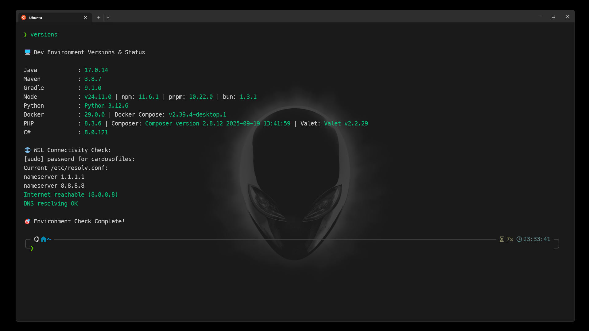

<div align="center" id="top">

<h1 align="center">🚀 Ambiente Dev no WSL (Ubuntu) – Guia Completo</h1>

[](#índice)
[](https://learn.microsoft.com/windows/wsl/)
[](https://ubuntu.com/wsl)
[](#7-nodejs-com-fnm-fast-node-manager)
[](#8-java-maven-e-gradle-com-sdkman)
[](#9-php)
[](#10-c-net---instalação-e-configuração)
[](#11-docker-nativo-no-wsl-alta-performance)
[](#13-github-cli-e-chave-ssh)
[](#13-github-cli-e-chave-ssh)

Este guia configura um terminal moderno, de altíssima performance e nível Sênior no Windows via WSL2 (Ubuntu). Inclui otimizações de sistema (Debloat), devolução de memória RAM dinâmica, Zsh + Oh My Zsh, tema Powerlevel10k, ferramentas de desenvolvimento em suas versões mais recentes (Node.js, Java, PHP, .NET) e **Docker Engine Nativo** integrado ao `systemd` (sem o peso do Docker Desktop).

[](https://skillicons.dev)

</div>

---

- Testado em: Windows 11 + WSL 2 (Ubuntu 24.04 LTS / 22.04 LTS)
- Shell: `zsh`
- Todos os comandos deste guia foram validados em uma instalação real do Ubuntu 24.04 (noble) sobre WSL 2



## Índice

### 📚 Guia Principal

- [Introdução e Pré-requisitos](#pré-requisitos)
- [1. Instalação do WSL (Ubuntu)](#1-instale-e-configure-o-wsl-ubuntu)
  - [1.1 Otimização de Performance (.wslconfig)](#11-otimização-de-performance-wslconfig)
- [2. Atualização do sistema](#2-atualize-o-sistema)
  - [2.1 Limpeza e Debloat (Alta Performance)](#21-limpeza-e-debloat-alta-performance)
- [3. Zsh + Oh My Zsh](#3-configure-zsh--oh-my-zsh)
- [4. Tema Powerlevel10k](#4-tema-moderno-com-powerlevel10k)
  - [Alternativa: Starship (prompt)](#alternativa-starship-prompt)
- [5. Plugins do Zsh](#5-plugins-úteis-para-zsh)
- [6. FZF (busca interativa)](#6-fzf-busca-interativa)
- [7. Node.js (fnm) + pnpm](#7-nodejs-com-fnm-fast-node-manager)
- [8. Java/Maven/Gradle (SDKMAN!)](#8-java-maven-e-gradle-com-sdkman)
- [9. PHP + Composer](#9-php)
- [10. .NET SDK](#10-c-net---instalação-e-configuração)
- [11. Docker Nativo no WSL (Alta Performance)](#11-docker-nativo-no-wsl-alta-performance)
- [12. Extras recomendados](#12-extras-recomendados)
- [13. GitHub CLI e Chave SSH](#13-github-cli-e-chave-ssh)
- [Validação da Instalação](#validação-da-instalação)
- [Problemas Comuns (Troubleshooting)](#problemas-comuns-troubleshooting)
- [Minhas Configurações do ZSH](#minhas-configurações-do-zsh)
- [Scripts Disponíveis em /src](#scripts-disponíveis-em-src)

### 📖 Documentação dos Scripts (`/docs`)

- [check-version.md](docs/check-version.md) - Verificar versões de ferramentas instaladas
- [docker-login.md](docs/docker-login.md) - Autenticação no Docker Hub
- [fastify-postgresql-script.md](docs/fastify-postgresql-script.md) - Criar API Fastify com PostgreSQL
- [git-push-faculdade.md](docs/git-push-faculdade.md) - Push para remote faculdade
- [git-push-origin.md](docs/git-push-origin.md) - Push para remote origin
- [install.md](docs/install.md) - Instalação automatizada do ambiente
- [next-shadcn-biome.md](docs/next-shadcn-biome.md) - Criar projeto Next.js com Biome
- [next-shadcn-prettierrc.md](docs/next-shadcn-prettierrc.md) - Criar projeto Next.js com Prettier
- [react-router-v7.md](docs/react-router-v7.md) - Criar projeto React Router v7
- [restart-docker.md](docs/restart-docker.md) - Reiniciar containers Docker
- [vscode-extensions-install.md](docs/vscode-extensions-install.md) - Instalar extensões VS Code

---

## Pré-requisitos

[](https://learn.microsoft.com/windows/wsl/)
[](https://ubuntu.com/wsl)
[](https://aka.ms/terminal)
[](https://www.nerdfonts.com/)

- Windows 10/11 com suporte ao WSL 2
- Windows Terminal (recomendado) instalado
- Fonte Nerd Font instalada no Windows (ex.: MesloLGS NF, JetBrainsMono)

## 1) Instale e configure o WSL (Ubuntu)

No PowerShell do Windows como Administrador:

```powershell
wsl --install -d Ubuntu

# Garanta que o WSL está na versão 2.x (necessário para os recursos do passo 1.1)
wsl --update
wsl --version
```

Reinicie o PC se necessário, crie seu usuário Linux no primeiro login do Ubuntu e volte aqui.

### 1.1) Otimização de Performance (.wslconfig)

Para evitar que o processo `vmmem` consuma toda a RAM do seu Windows, vamos forçar o Linux a devolver a memória ociosa.

> **⚠️ Atenção ao criar o arquivo:** o Bloco de Notas salva como `.wslconfig.txt` por padrão, e aí a configuração é simplesmente ignorada. O jeito seguro é abrir o caminho exato pelo PowerShell:
>
> ```powershell
> notepad $env:USERPROFILE\.wslconfig
> ```
>
> Confirme a criação do arquivo e cole o conteúdo abaixo.

```ini
[wsl2]
# Regra prática: ~50% da RAM física da máquina (em um PC de 16 GB, use 8GB)
memory=8GB
# Metade dos núcleos lógicos costuma ser suficiente
processors=4
swap=2GB
localhostForwarding=true

[experimental]
# A Mágica: Força o Linux a devolver a RAM ociosa para o Windows em tempo real
autoMemoryReclaim=dropcache
sparseVhd=true
```

> **Nota:** `autoMemoryReclaim` e `sparseVhd` exigem **WSL 2.0 ou superior**. Se `wsl --version` mostrar algo abaixo disso, rode `wsl --update` antes — caso contrário as chaves são ignoradas silenciosamente.

No PowerShell, reinicie o WSL para aplicar: `wsl --shutdown`

## 2) Atualize o sistema

No Ubuntu/WSL:

```bash
sudo apt update && sudo apt upgrade -y
sudo apt install -y curl git unzip build-essential zip htop wget ca-certificates gnupg lsb-release software-properties-common apt-transport-https
```

### 2.1) Limpeza e Debloat (Alta Performance)

Para um boot instantâneo do terminal e menor uso de RAM, vamos remover os pacotes e serviços de background que não precisamos em um ambiente de desenvolvimento limpo:

```bash
# 1) Habilitar systemd nativo no WSL (essencial para o Docker)
# ⚠️ NUNCA sobrescreva o /etc/wsl.conf: ele pode conter "[user] default=seu-usuario".
#    Perder essa linha faz o WSL passar a abrir como root.
cat /etc/wsl.conf 2>/dev/null   # veja o que já existe antes de mexer

sudo cp /etc/wsl.conf /etc/wsl.conf.bak 2>/dev/null || true
if ! grep -qE '^\s*systemd\s*=' /etc/wsl.conf 2>/dev/null; then
  printf '\n[boot]\nsystemd=true\n' | sudo tee -a /etc/wsl.conf > /dev/null
fi
cat /etc/wsl.conf
```

> Se o seu `/etc/wsl.conf` **já tiver** um bloco `[boot]`, adicione apenas a linha `systemd=true` dentro dele em vez de rodar o `tee` acima. O Ubuntu 24.04 costuma já vir com o systemd habilitado — nesse caso não há nada a fazer aqui.

```bash
# 2) Remover Snapd (Lento e não otimizado para WSL)
sudo systemctl stop snapd.service snapd.socket 2>/dev/null || true
sudo systemctl disable snapd.service snapd.socket 2>/dev/null || true
sudo apt-get purge snapd -y 2>/dev/null || true
sudo rm -rf /snap /var/snap /var/lib/snapd /var/cache/snapd

# 3) Desabilitar serviços nativos (Use Docker para bancos de dados!)
for svc in mysql mariadb apache2 nginx redis-server; do
    sudo systemctl disable --now "$svc" 2>/dev/null || true
done
```

**Importante:** Após rodar estes comandos, abra o PowerShell do Windows e digite `wsl --shutdown`. Ao abrir o Ubuntu novamente, o `systemd` estará ativo e o sistema estará "limpo".

## 3) Configure Zsh + Oh My Zsh

```bash
sudo apt install -y zsh
chsh -s "$(command -v zsh)"

# Se o chsh falhar com erro de PAM/autenticação (acontece em algumas imagens WSL):
# sudo chsh -s "$(command -v zsh)" "$USER"

# Oh My Zsh
sh -c "$(curl -fsSL https://raw.githubusercontent.com/ohmyzsh/ohmyzsh/master/tools/install.sh)"
```

O instalador do Oh My Zsh também oferece trocar o shell padrão — se você já rodou o `chsh` acima, pode recusar. Se o shell não trocar imediatamente, rode: `exec zsh`.

## 4) Tema moderno com Powerlevel10k

```bash
git clone --depth=1 https://github.com/romkatv/powerlevel10k.git ${ZSH_CUSTOM:-~/.oh-my-zsh/custom}/themes/powerlevel10k
```

Edite `~/.zshrc` e altere o tema: `ZSH_THEME="powerlevel10k/powerlevel10k"`.
Recarregue com `exec zsh` para abrir o assistente de visual.

<div align="right">
  <a href="#top">⬆️ Voltar ao topo</a>
</div>

---

### Alternativa: Starship (prompt)

<details>
<summary>Clique aqui para ver a configuração do Starship</summary>

```bash
curl -sS https://starship.rs/install.sh | sh
echo 'eval "$(starship init zsh)"' >> ~/.zshrc
mkdir -p ~/.config
nano ~/.config/starship.toml
```

Cole a configuração do Starship de sua preferência no arquivo criado.

> Use **ou** o Powerlevel10k **ou** o Starship. Os dois juntos brigam pelo controle do prompt.

</details>

## 5) Plugins úteis para Zsh

```bash
# Autosuggestions
git clone https://github.com/zsh-users/zsh-autosuggestions ${ZSH_CUSTOM:-~/.oh-my-zsh/custom}/plugins/zsh-autosuggestions

# Syntax Highlighting
git clone https://github.com/zsh-users/zsh-syntax-highlighting.git ${ZSH_CUSTOM:-~/.oh-my-zsh/custom}/plugins/zsh-syntax-highlighting
```

Adicione no seu `~/.zshrc` (esta é exatamente a lista usada na [configuração final](#minhas-configurações-do-zsh)):

```bash
plugins=(
  git
  autojump
  fzf
  history-substring-search
  zsh-autosuggestions
  zsh-syntax-highlighting   # precisa ser SEMPRE o último da lista
)
```

> **⚠️ A ordem importa:** o `zsh-syntax-highlighting` precisa ser o **último** plugin carregado. Ele envolve os widgets já registrados pelo Zsh; qualquer plugin carregado depois dele fica sem realce.

<details>
<summary>Opcional (avançado): zsh-autocomplete</summary>

O [`zsh-autocomplete`](https://github.com/marlonrichert/zsh-autocomplete) troca o sistema de completions do Zsh por um menu que aparece enquanto você digita. É poderoso, mas **conflita com o `zsh-autosuggestions` e com os keybindings padrão do Oh My Zsh** — não recomendo para quem está montando o ambiente pela primeira vez.

```bash
git clone https://github.com/marlonrichert/zsh-autocomplete ${ZSH_CUSTOM:-~/.oh-my-zsh/custom}/plugins/zsh-autocomplete
```

Se for usar, carregue-o **antes** do `zsh-syntax-highlighting` e revise os atalhos de seta/histórico.

</details>

<div align="right">
  <a href="#top">⬆️ Voltar ao topo</a>
</div>

## 6) FZF (busca interativa)

```bash
sudo apt install -y fzf autojump
```

Os plugins `fzf` e `autojump` (já incluídos na lista do passo 5) ativam os atalhos `Ctrl+R` (histórico), `Ctrl+T` (arquivos) e o comando `j <pasta>`.

## 7) Node.js com fnm (Fast Node Manager)

```bash
curl -fsSL https://fnm.vercel.app/install | bash
```

O instalador já tenta escrever no seu shell profile. Confira o `~/.zshrc` e, se a linha não estiver lá, adicione:

```bash
eval "$(fnm env --use-on-cd --shell zsh)"
```

> `--use-on-cd` é o que faz o fnm trocar de versão automaticamente ao entrar numa pasta com `.nvmrc` ou `.node-version`. Sem essa flag o auto-switch não funciona.

Instale o Node e o `pnpm`:

```bash
exec zsh
fnm install --lts
fnm default lts-latest

corepack enable
corepack install -g pnpm@latest
```

> `corepack install -g` substitui o antigo `corepack prepare --activate` (depreciado). Rode uma vez na instalação — não precisa ficar no `~/.zshrc`.

## 8) Java, Maven e Gradle com SDKMAN!

```bash
curl -s "https://get.sdkman.io" | bash
source "$HOME/.sdkman/bin/sdkman-init.sh"

# Veja os identificadores disponíveis antes de fixar uma versão
sdk list java

sdk install java     # sem argumento: instala a versão recomendada pelo SDKMAN
sdk install maven
sdk install gradle
```

Para fixar um LTS específico, use o identificador exato que aparece no `sdk list java` (ex.: `sdk install java 21.0.9-tem`). Evite copiar versões fixas de tutoriais: patches antigos saem do índice e o comando falha.

O instalador grava o init no `~/.bashrc` e no `~/.zshrc`. Se você trocou para o zsh **depois** de instalar o SDKMAN, confirme que estas linhas existem no `~/.zshrc`:

```bash
export SDKMAN_DIR="$HOME/.sdkman"
[[ -s "$SDKMAN_DIR/bin/sdkman-init.sh" ]] && source "$SDKMAN_DIR/bin/sdkman-init.sh"
```

Para configurar a conexão do IntelliJ IDEA no Windows com o WSL, utilize o [JetBrains Gateway](https://www.jetbrains.com/remote-development/gateway/).

<div align="right">
  <a href="#top">⬆️ Voltar ao topo</a>
</div>

## 9) PHP

```bash
sudo apt install -y software-properties-common
sudo add-apt-repository ppa:ondrej/php -y
sudo apt update

# Veja as versões disponíveis no PPA (hoje o ondrej já entrega 8.4/8.5)
apt-cache search --names-only '^php[0-9]\.[0-9]+-cli$'

# Instalar PHP CLI e extensões (Sem Apache ou FPM para manter o WSL leve)
PHP_V=8.4
sudo apt install -y php${PHP_V}-cli php${PHP_V}-curl php${PHP_V}-mbstring php${PHP_V}-xml \
  php${PHP_V}-zip php${PHP_V}-mysql php${PHP_V}-pgsql php${PHP_V}-sqlite3 php${PHP_V}-gd \
  php${PHP_V}-bcmath php${PHP_V}-intl php${PHP_V}-redis php${PHP_V}-xdebug

# Composer
curl -sS https://getcomposer.org/installer -o /tmp/composer-setup.php
sudo php /tmp/composer-setup.php --install-dir=/usr/local/bin --filename=composer
rm /tmp/composer-setup.php
```

## 10) C# (.NET) - Instalação e Configuração

> **⚠️ Não adicione o repositório da Microsoft no Ubuntu 22.04+.** A partir do 22.04 o .NET vem no repositório **oficial do Ubuntu**, e instalar também o `packages-microsoft-prod.deb` faz os dois feeds publicarem os mesmos pacotes — o resultado é conflito de dependências e o clássico erro `Unable to locate package dotnet-sdk-X`. A própria Microsoft desaconselha o mix sem pinning manual.

```bash
# Confirme que o SDK já está disponível no feed nativo
apt-cache policy dotnet-sdk-10.0

sudo apt update
sudo apt install -y dotnet-sdk-10.0   # LTS atual; use dotnet-sdk-8.0 apenas se o projeto exigir
```

<details>
<summary>Já adicionou o repositório da Microsoft? Como reverter</summary>

```bash
sudo apt remove -y packages-microsoft-prod
sudo rm -f /etc/apt/sources.list.d/microsoft-prod.list
sudo apt update
```

</details>

Com o pacote da distro o SDK fica em `/usr/lib/dotnet` e o `DOTNET_ROOT` **não precisa ser definido**. Adicione ao `~/.zshrc` apenas:

```bash
export DOTNET_CLI_TELEMETRY_OPTOUT=1
export DOTNET_NOLOGO=1
export PATH="$PATH:$HOME/.dotnet/tools"   # ferramentas instaladas com "dotnet tool install -g"
```

Se alguma ferramenta exigir `DOTNET_ROOT`, derive do binário real em vez de chutar o caminho:

```bash
export DOTNET_ROOT="$(dirname "$(readlink -f "$(command -v dotnet)")")"
```

<div align="right">
  <a href="#top">⬆️ Voltar ao topo</a>
</div>

## 11) Docker Nativo no WSL (Alta Performance)

[](https://docs.docker.com/engine/install/ubuntu/)

**Adeus, Docker Desktop!** Para máxima performance e economia absurda de memória RAM no Windows, vamos instalar a **Docker Engine Nativa** diretamente no WSL2 integrada ao `systemd`.

**Certifique-se de ter desinstalado o Docker Desktop do Windows antes de continuar.**

### 1. Remova instalações antigas e adicione o repositório

```bash
sudo apt-get remove -y docker docker-engine docker.io containerd runc
sudo apt-get update
sudo apt-get install -y ca-certificates curl gnupg

sudo install -m 0755 -d /etc/apt/keyrings
curl -fsSL https://download.docker.com/linux/ubuntu/gpg | sudo gpg --dearmor -o /etc/apt/keyrings/docker.gpg
sudo chmod a+r /etc/apt/keyrings/docker.gpg

echo "deb [arch=$(dpkg --print-architecture) signed-by=/etc/apt/keyrings/docker.gpg] https://download.docker.com/linux/ubuntu $(. /etc/os-release && echo "$VERSION_CODENAME") stable" | sudo tee /etc/apt/sources.list.d/docker.list > /dev/null
```

### 2. Instale o Docker Engine completo

```bash
sudo apt-get update
sudo apt-get install -y docker-ce docker-ce-cli containerd.io docker-buildx-plugin docker-compose-plugin
```

### 3. Habilite via Systemd e adicione as permissões

Como o nosso WSL agora usa `systemd` (ativado no passo 2.1), o Docker pode rodar nativamente em background sem precisar de gambiarras:

```bash
# Iniciar e habilitar para iniciar junto com o WSL
sudo systemctl enable --now docker

# Adicionar seu usuário ao grupo Docker (evita o uso de sudo)
sudo groupadd docker || true
sudo usermod -aG docker "$USER"
```

**⚠️ Importante:** Execute `newgrp docker` ou feche o terminal e abra novamente para as permissões aplicarem. Depois, teste rodando:

```bash
docker run --rm hello-world
docker compose version
```

> Se você usava Docker Desktop antes, rode `docker context use default` para garantir que o CLI aponte para o daemon nativo, e não para um contexto órfão do Desktop.

## 12) Extras recomendados

```bash
sudo apt install -y bat fd-find tree neofetch

mkdir -p ~/.local/bin
command -v fdfind >/dev/null && ln -sf "$(command -v fdfind)" ~/.local/bin/fd
command -v batcat >/dev/null && ln -sf "$(command -v batcat)" ~/.local/bin/bat
```

> No Debian/Ubuntu os binários se chamam `fdfind` e `batcat` (conflito de nomes com outros pacotes) — por isso os symlinks. Os guards com `command -v` evitam criar um link quebrado caso a instalação falhe.
> O `neofetch` existe no 22.04/24.04, mas foi removido do Ubuntu 25.04+ — nas versões novas use `fastfetch`.

Garanta que `~/.local/bin` está no PATH adicionando ao `~/.zshrc`:

```bash
export PATH="$HOME/.local/bin:$PATH"
```

<div align="right">
  <a href="#top">⬆️ Voltar ao topo</a>
</div>

## 13) GitHub CLI e Chave SSH

Instalação oficial do `gh` (keyring em `/etc/apt/keyrings`):

```bash
(type -p wget >/dev/null || (sudo apt update && sudo apt install wget -y)) \
  && sudo mkdir -p -m 755 /etc/apt/keyrings \
  && wget -qO- https://cli.github.com/packages/githubcli-archive-keyring.gpg | sudo tee /etc/apt/keyrings/githubcli-archive-keyring.gpg > /dev/null \
  && sudo chmod go+r /etc/apt/keyrings/githubcli-archive-keyring.gpg \
  && echo "deb [arch=$(dpkg --print-architecture) signed-by=/etc/apt/keyrings/githubcli-archive-keyring.gpg] https://cli.github.com/packages stable main" | sudo tee /etc/apt/sources.list.d/github-cli.list > /dev/null \
  && sudo apt update && sudo apt install gh -y
```

Configuração do Git:

```bash
git config --global user.name "Seu Nome"
git config --global user.email "seu-email@exemplo.com"
git config --global init.defaultBranch main
```

Chave SSH:

```bash
ssh-keygen -t ed25519 -C "seu-email@exemplo.com"
eval "$(ssh-agent -s)"
ssh-add ~/.ssh/id_ed25519

# Autentique no terminal (escolha SSH quando perguntado)
gh auth login

# O gh sobe a chave pública para a sua conta — sem copiar e colar no navegador
gh ssh-key add ~/.ssh/id_ed25519.pub --title "WSL Ubuntu"

# Teste a conexão
ssh -T git@github.com
```

> Prefere o fluxo manual? `cat ~/.ssh/id_ed25519.pub` e cole em <https://github.com/settings/keys>.
>
> **O `ssh-agent` não persiste entre sessões.** O bloco que sobe o agent automaticamente já está incluído na [configuração do ZSH](#minhas-configurações-do-zsh) mais abaixo.

<div align="right">
  <a href="#top">⬆️ Voltar ao topo</a>
</div>

## Validação da Instalação

Rode **depois** de reabrir o terminal (ou `exec zsh`) — antes disso o PATH ainda não tem as ferramentas e você recebe falsos negativos.

```bash
echo "🔍 Validando instalações..."
echo "==========================================="
check() { command -v "$1" >/dev/null 2>&1 && echo "✅ $1: $(eval "$2" 2>&1 | head -n 1)" || echo "❌ $1 não encontrado"; }

check zsh      'zsh --version'
check git      'git --version'
check fnm      'fnm --version'
check node     'node -v'
check pnpm     'pnpm -v'
check java     'java -version 2>&1'
check mvn      'mvn -v'
check gradle   'gradle -v 2>&1 | grep Gradle'
check php      'php -v'
check composer 'composer --version'
check dotnet   'dotnet --version'
check docker   'docker --version'
check gh       'gh --version'
check bat      'bat --version'
check fd       'fd --version'
echo "-------------------------------------------"
docker compose version >/dev/null 2>&1 && echo "✅ docker compose: $(docker compose version)" || echo "❌ docker compose não encontrado"
systemctl is-active docker >/dev/null 2>&1 && echo "✅ daemon docker ativo (systemd)" || echo "❌ daemon docker inativo"
echo "==========================================="
```

## Problemas Comuns (Troubleshooting)

### 🐳 Docker diz "Cannot connect to the Docker daemon"

- **Motivo:** O serviço do Docker não subiu ou você não tem as permissões de grupo.
- **Solução Sênior:**
  1. Confira o status do systemd: `systemctl status docker`
  2. Garanta que deu restart no WSL (`wsl --shutdown` no PowerShell).
  3. Garanta que rodou o `newgrp docker` para herdar as permissões do grupo.
  4. Se `systemctl` responder "System has not been booted with systemd", o `[boot] systemd=true` não foi aplicado — revise o passo [2.1](#21-limpeza-e-debloat-alta-performance).

### 🔴 `Unable to locate package dotnet-sdk-X`

- **Motivo:** repositório da Microsoft convivendo com o feed nativo do Ubuntu (22.04+).
- **Solução:** remova o `packages-microsoft-prod` e instale pelo repositório do Ubuntu — veja o passo [10](#10-c-net---instalação-e-configuração).

### ⚠️ `command not found: pyenv` (ou `dotnet`, `bun`) a cada terminal aberto

- **Motivo:** o `~/.zshrc` chama `eval "$(pyenv init -)"` sem verificar se a ferramenta existe.
- **Solução:** todo bloco opcional deve ter guard, como na configuração deste repositório:
  ```bash
  command -v pyenv >/dev/null 2>&1 && eval "$(pyenv init - zsh)"
  ```
- **Bônus:** qualquer saída no início do `.zshrc` também dispara o aviso do *instant prompt* do Powerlevel10k.

### 🎨 Realce de sintaxe não funciona / autosuggestions estranho

- **Motivo:** ordem dos plugins. O `zsh-syntax-highlighting` precisa ser o **último** da lista `plugins=(...)`.
- **Solução:** revise o passo [5](#5-plugins-úteis-para-zsh). Se usa `zsh-autocomplete`, saiba que ele conflita com o `zsh-autosuggestions`.

### 🟢 `fnm` não troca a versão do Node automaticamente

- **Motivo:** faltou a flag `--use-on-cd` no `eval "$(fnm env ...)"`.
- **Solução:** `eval "$(fnm env --use-on-cd --shell zsh)"` no `~/.zshrc`.

### 👤 O WSL passou a abrir como `root`

- **Motivo:** o `/etc/wsl.conf` foi sobrescrito e perdeu o bloco `[user] default=...`.
- **Solução:** no PowerShell, `wsl --manage Ubuntu --set-default-user SEU_USUARIO`, ou restaure o backup criado no passo 2.1 (`/etc/wsl.conf.bak`).

### 🎨 Tema sem ícones

- **Solução:** Instale uma Nerd Font (MesloLGS NF ou JetBrainsMono) no Windows e selecione-a no Perfil do seu "Windows Terminal".

### 💾 `.wslconfig` parece não fazer efeito

- **Motivo:** arquivo salvo como `.wslconfig.txt` pelo Bloco de Notas, ou WSL abaixo da versão 2.0.
- **Solução:** `notepad $env:USERPROFILE\.wslconfig` no PowerShell + `wsl --update` + `wsl --shutdown`.

## Minhas Configurações do ZSH

> **⚠️ Dica:** Esta é a configuração base para o perfil Full Stack Dev Sênior. Todos os blocos opcionais têm guard (`command -v` / `[[ -d ]]`), então você pode copiar o arquivo inteiro mesmo sem ter instalado tudo. Ajuste os pontos marcados com **AJUSTE**.

```bash
# ================================
# ~/.zshrc - Full Stack Dev Senior
# ================================

# ------------------------
# Powerlevel10k instant prompt (precisa ser o PRIMEIRO bloco do arquivo)
# ------------------------
typeset -g POWERLEVEL9K_INSTANT_PROMPT=quiet
if [[ -r "${XDG_CACHE_HOME:-$HOME/.cache}/p10k-instant-prompt-${(%):-%n}.zsh" ]]; then
  source "${XDG_CACHE_HOME:-$HOME/.cache}/p10k-instant-prompt-${(%):-%n}.zsh"
fi

# ------------------------
# Oh My Zsh
# ------------------------
export ZSH="$HOME/.oh-my-zsh"
ZSH_THEME="powerlevel10k/powerlevel10k"

plugins=(
  git
  autojump
  fzf
  history-substring-search
  zsh-autosuggestions
  zsh-syntax-highlighting   # SEMPRE o último: ele envolve os widgets já carregados
)

source $ZSH/oh-my-zsh.sh

ZSH_AUTOSUGGEST_HIGHLIGHT_STYLE='fg=#7f7f7f'

# ------------------------
# Core Settings
# ------------------------
export TERM="xterm-256color"
DISABLE_AUTO_TITLE=true
ENABLE_CORRECTION="true"

# PATH do usuário: ~/.local/bin (bat, fd) e ~/bin (scripts deste repositório)
export PATH="$HOME/.local/bin:$HOME/bin:$PATH"

# ------------------------
# Version Managers
# ------------------------

# SDKMAN (Java / Maven / Gradle)
export SDKMAN_DIR="$HOME/.sdkman"
[[ -s "$SDKMAN_DIR/bin/sdkman-init.sh" ]] && source "$SDKMAN_DIR/bin/sdkman-init.sh"

# --- FIX Java (WSL + Gradle + SDKMAN) ---
if [[ -d "$SDKMAN_DIR/candidates/java/current" ]]; then
  export JAVA_HOME="$SDKMAN_DIR/candidates/java/current"
  export PATH="$JAVA_HOME/bin:$PATH"
fi

# FNM (Node.js) — --use-on-cd faz o auto-switch por .nvmrc / .node-version
FNM_PATH="$HOME/.local/share/fnm"
if [[ -d "$FNM_PATH" ]]; then
  export PATH="$FNM_PATH:$PATH"
  eval "$(fnm env --use-on-cd --shell zsh)"
fi

# Bun (opcional)
export BUN_INSTALL="$HOME/.bun"
[[ -d "$BUN_INSTALL/bin" ]] && export PATH="$BUN_INSTALL/bin:$PATH"
[[ -s "$BUN_INSTALL/_bun" ]] && source "$BUN_INSTALL/_bun"

# Pyenv (opcional — só carrega se estiver instalado)
export PYENV_ROOT="$HOME/.pyenv"
[[ -d "$PYENV_ROOT/bin" ]] && export PATH="$PYENV_ROOT/bin:$PATH"
if command -v pyenv >/dev/null 2>&1; then
  eval "$(pyenv init - zsh)"
  command -v pyenv-virtualenv-init >/dev/null 2>&1 && eval "$(pyenv virtualenv-init -)"
fi

# ------------------------
# .NET (pacote do Ubuntu — o SDK fica em /usr/lib/dotnet, sem DOTNET_ROOT)
# ------------------------
export DOTNET_CLI_TELEMETRY_OPTOUT=1
export DOTNET_NOLOGO=1
export PATH="$PATH:$HOME/.dotnet/tools"

# ------------------------
# Autojump
# ------------------------
[[ -s /usr/share/autojump/autojump.sh ]] && source /usr/share/autojump/autojump.sh

# ------------------------
# SSH agent (mantém a chave carregada durante a sessão)
# ------------------------
if [[ -z "$SSH_AUTH_SOCK" && -f "$HOME/.ssh/id_ed25519" ]]; then
  eval "$(ssh-agent -s)" >/dev/null
  ssh-add -q "$HOME/.ssh/id_ed25519" 2>/dev/null
fi

# ------------------------
# IDE Aliases
# ------------------------
# AJUSTE: troque SEU_USUARIO_WINDOWS pelo seu usuário do Windows (veja em /mnt/c/Users)
WIN_USER="SEU_USUARIO_WINDOWS"
alias cursor="/mnt/c/Users/$WIN_USER/AppData/Local/Programs/Cursor/cursor.exe"

# Resolve a versão instalada do IntelliJ dinamicamente (nada de versão fixa no alias)
idea() {
  local dir
  dir="$(ls -d /mnt/c/Program\ Files/JetBrains/IntelliJ* 2>/dev/null | tail -1)"
  if [[ -n "$dir" ]]; then
    "$dir/bin/idea64.exe" "$@"
  else
    echo "IntelliJ não encontrado em C:\\Program Files\\JetBrains"
  fi
}

# ------------------------
# Custom Script Aliases (scripts copiados para ~/bin — veja a seção "Scripts")
# ------------------------
alias git-push-origin='~/bin/git-push-origin.sh'
alias git-push-faculdade='~/bin/git-push-faculdade.sh'
alias next-shadcn-biome='~/bin/next-shadcn-biome.sh'
alias next-shadcn-prettierrc='~/bin/next-shadcn-prettierrc.sh'
alias restart-docker='~/bin/restart-docker.sh'
alias docker-login='~/bin/docker-login.sh'
alias react-router-v7='~/bin/react-router-v7.sh'
alias create-fastify-app='~/bin/fastify-postgresql-script.sh'
alias versions='~/bin/check-version.sh'

# Task Master
alias tm='task-master'
alias taskmaster='task-master'

# ──────────────────────
# Useful Aliases
# ──────────────────────

# System
alias update='sudo apt update && sudo apt upgrade -y'
alias cleanup='sudo apt autoremove -y && sudo apt autoclean'

# Navigation
alias ..='cd ..'            # Go up one directory level
alias ...='cd ../..'        # Go up two directory levels
alias ....='cd ../../..'    # Go up three directory levels

# Git
alias gs='git status'
alias ga='git add'
alias gc='git commit -m'
alias gp='git push'
alias gl='git log --oneline --graph --decorate'

# Productivity
alias c='clear'
alias h='history'
alias ll='ls -lah'

# Container management
alias dps='docker ps'
alias dpsa='docker ps -a'
alias dstart='docker start'
alias dstop='docker stop'
alias drm='docker rm'
alias drmf='docker rm -f'

# Docker Compose
alias dc='docker compose'
alias dcup='docker compose up -d'
alias dcdown='docker compose down'
alias dclogs='docker compose logs -f'
alias dcps='docker compose ps'
alias dcrestart='docker compose restart'

# ------------------------
# Powerlevel10k Config (mantenha no fim do arquivo)
# ------------------------
[[ ! -f ~/.p10k.zsh ]] || source ~/.p10k.zsh
```

## Scripts Disponíveis em `/src`

Este repositório inclui diversos scripts bash automatizados. Copie-os para `~/bin` — que já está no PATH pela configuração acima — e use os `aliases` da seção anterior:

```bash
# Copiar scripts para ~/bin
mkdir -p ~/bin
cp src/*.sh ~/bin/
chmod +x ~/bin/*.sh
```

| Script | Documentação |
|---|---|
| `check-version.sh` | [check-version.md](docs/check-version.md) |
| `docker-login.sh` | [docker-login.md](docs/docker-login.md) |
| `fastify-postgresql-script.sh` | [fastify-postgresql-script.md](docs/fastify-postgresql-script.md) |
| `git-push-faculdade.sh` | [git-push-faculdade.md](docs/git-push-faculdade.md) |
| `git-push-origin.sh` | [git-push-origin.md](docs/git-push-origin.md) |
| `install.sh` | [install.md](docs/install.md) |
| `next-shadcn-biome.sh` | [next-shadcn-biome.md](docs/next-shadcn-biome.md) |
| `next-shadcn-prettierrc.sh` | [next-shadcn-prettierrc.md](docs/next-shadcn-prettierrc.md) |
| `react-router-v7.sh` | [react-router-v7.md](docs/react-router-v7.md) |
| `restart-docker.sh` | [restart-docker.md](docs/restart-docker.md) |
| `vscode-extensions-install.sh` | [vscode-extensions-install.md](docs/vscode-extensions-install.md) |
| `dev-machine-setup.sh` | — |
| `idea.sh` | — |

<div align="center"> 
  <b>Construído com extrema eficiência e performance para ambientes profissionais.</b><br> 
  <a href="#top">⬆️ Voltar ao topo</a> 
</div>
